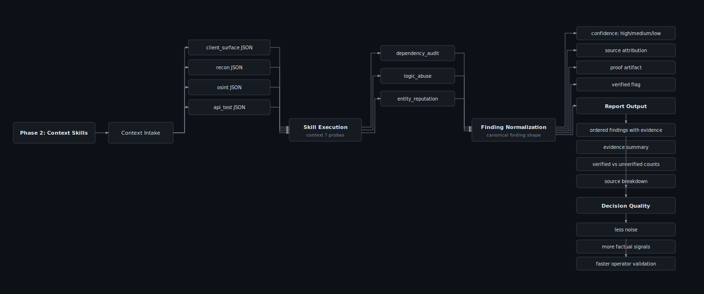
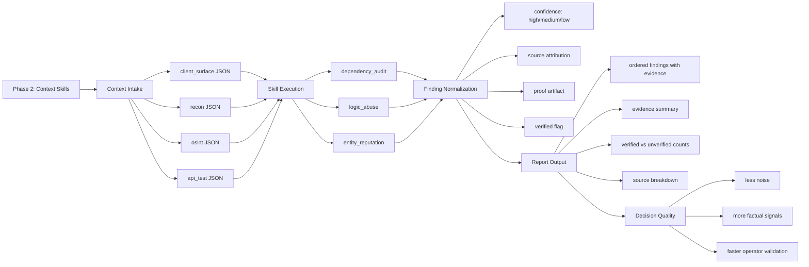

# Phase 2 context skills

Primary source lives in `docs/diagrams/phase2-context-flow.mmd`.

**SVG file:** [`phase2-context-flow.svg`](phase2-context-flow.svg) (open in browser or VS Code preview)

Use this in GitHub, Notion, or [mermaid.live](https://mermaid.live).

Optional PNG export: `docs/assets/phase2-context-flow-diagram.png`
