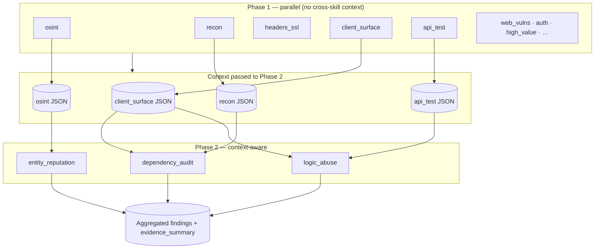

# Phase 1 → Phase 2 web scan (context flow)

Render in GitHub, Notion, or [mermaid.live](https://mermaid.live).

```mermaid
flowchart TB
  subgraph P1["Phase 1 — parallel (no cross-skill context)"]
    A[osint]
    B[recon]
    C[headers_ssl]
    D[client_surface]
    E[api_test]
    F[web_vulns · auth · high_value · …]
  end

  subgraph CTX["Context passed to Phase 2"]
    D1[(client_surface JSON)]
    R1[(recon JSON)]
    O1[(osint JSON)]
    AP[(api_test JSON)]
  end

  subgraph P2["Phase 2 — context-aware"]
    DA[dependency_audit]
    LA[logic_abuse]
    ER[entity_reputation]
  end

  P1 --> CTX
  D --> D1
  B --> R1
  A --> O1
  E --> AP

  D1 --> DA
  R1 --> DA
  D1 --> LA
  AP --> LA
  O1 --> ER

  DA --> OUT[(Aggregated findings + evidence_summary)]
  LA --> OUT
  ER --> OUT
```

**PNG export:** `docs/assets/phase2-context-flow-diagram.png`
