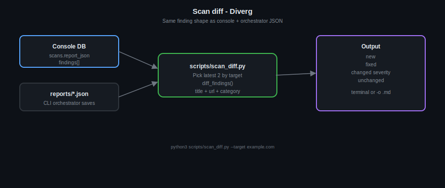

# Scan diffing: see what changed between two security scans

Running a scan tells you what the tooling sees *right now*. The interesting story is often **what changed** since the last run: new issues, things you fixed, or severity shifts after a deploy. That is **scan diffing**—comparing two reports for the same target so you get a delta, not another wall of findings.

## Why it matters

- **After every release:** Did we introduce regressions or clear known items?
- **Before/after remediation:** Evidence that a fix worked (finding gone or downgraded).
- **Trends:** Are certain categories flaring up across sprints?

Without a structured diff, you re-read two JSON blobs or two PDFs and eyeball the difference. That is slow and error-prone.

## How Diverg does it

Diverg keeps a **single mental model** for a finding: the same shape in the web console (stored as `scans.report_json` → `findings[]`), in CLI output under `reports/*.json`, and in the API. The diff tool keys findings by **title + URL + category**, then classifies each item as:

| Bucket | Meaning |
|--------|---------|
| **New** | Present in the newer scan, absent in the older one |
| **Fixed** | Present in the older scan, gone in the newer one |
| **Changed severity** | Same logical finding, different severity |
| **Unchanged** | Still there, same severity |

You can drive it by **target** (it picks the latest two scans for that host from the DB, from files, or both—depending on flags) or by pointing at two explicit JSON paths.

## Flow (diagram)



*Same finding shape as the console and orchestrator JSON; output goes to the terminal or `-o` as Markdown.*

## Try it

```bash
# Latest two scans for a target (DB + reports/ when both exist)
python scripts/scan_diff.py --target example.com

# Console database only (e.g. scans from the dashboard)
python scripts/scan_diff.py --target example.com --source db

# Orchestrator JSON only
python scripts/scan_diff.py --target example.com --source files

# Two explicit report files
python scripts/scan_diff.py --old reports/a.json --new reports/b.json

# Write a Markdown summary to disk (good for release notes or tickets)
python scripts/scan_diff.py --target example.com -o scan-delta.md
```

If your dashboard database is not at `data/dashboard.db`, set **`DIVERG_DB_PATH`** to match `api_server.py` / your deployment.

Unit coverage lives in `tests/test_scan_diff.py`.

## Closing

Scan diffing turns “we ran it again” into **actionable deltas**: what to celebrate (fixed), what to triage (new), and what to re-check (severity moves). The diagram above is the same pipeline the repo documents in `scripts/scan_diff.py` and `README.md`.

---

## Snippets for social (optional)

**Short (X / thread hook):**  
We added scan diffing for Diverg: compare two runs for the same site and get *new*, *fixed*, *changed severity*, and *unchanged*—same finding schema as the console and CLI JSON. Diagram + CLI in the repo under `docs/posts/scan-diffing.md`.

**LinkedIn-style:**  
Security scans produce snapshots. Teams care about **deltas**: what broke, what healed, what shifted after a release. Our scan diff CLI aligns dashboard history and `reports/*.json`, keys findings in a stable way, and outputs a clear delta (terminal or Markdown). Useful for release notes, remediation proof, and avoiding manual JSON diffing.

**More copy variants (thread + short lines):** [`docs/TWEET_SCAN_DIFF.md`](../TWEET_SCAN_DIFF.md)
